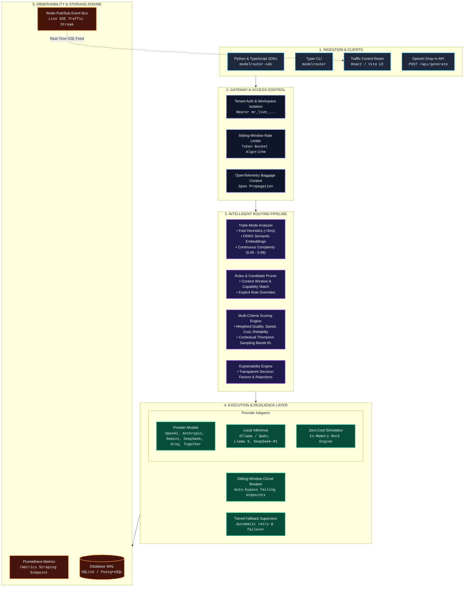

# Model Router

[](https://pypi.org/project/model-router-cli/)
[](https://pypi.org/project/model-router-cli/)
[](https://opensource.org/licenses/Apache-2.0)
[](https://pepy.tech/project/model-router-cli)

Intelligent, explainable, cost- and latency-aware LLM request routing platform, AI Traffic Control Room, and drop-in SDKs.

---

## The Real-World Problem
Companies building AI applications face ballooning API costs, rate limits, and latency spikes. They want to use large models (like GPT-4o, Claude 3.5 Sonnet, or JEV reasoning models) for complex reasoning, but cheaper/faster models (like Llama 3 or Haiku) for simple tasks. Manually writing logic to route these requests is brittle and hard to maintain.

## Why it's Unique (The "Edge")
- **The "Traffic Control Room":** A stunning frontend UI that makes routing decisions transparent and explainable. You don't just route; you see *why* a request went to a specific model.
- **100% Local & Self-Hosted:** No data leaves the user's infrastructure.
- **A/B Policy Experimentation:** Built-in tools to test different routing policies (e.g., "lowest cost" vs "balanced") and see projected savings.
- **Triple-Mode Analyzer:** Fast deterministic heuristics (<3ms), semantic ONNX embedding classification, and LLM-based continuous complexity scoring.
- **Thompson Sampling RL Auto-Tuning:** Contextual multi-armed bandit automatically adjusts model quality scores online based on real-time latency, throughput, and error rates.
- **Production-Ready Scalability:** Database-agnostic (SQLite for local dev, PostgreSQL for production) with Redis Pub/Sub powering real-time SSE traffic telemetry across distributed worker nodes.
- **Resilient Execution:** Built-in sliding-window circuit breaker dynamically bypasses failing upstream providers to prevent cascading latency spikes.
- **Enterprise Observability:** Standardized OpenTelemetry distributed tracing and native Prometheus `/metrics` exposition.

---

## Key Features

- **Triple-Mode Request Analyzer**: Deterministic heuristics (<3ms latency overhead), ONNX dense semantic embedding similarity, and continuous complexity scoring (0.05 to 0.99).
- **Explainable Multi-Criteria Routing Engine**: Normalized 0-100 scoring across Quality, Cost Efficiency, Speed, Capabilities, and Reliability with transparent decision factor reports and candidate rejection logs.
- **Thompson Sampling RL Auto-Tuner**: Online Beta-distribution bandit exploration and exploitation that dynamically refines candidate priors based on real-world feedback.
- **Multi-Tenant Workspaces & Rate Limiting**: Workspace tenant isolation, cryptographically hashed API keys (`mr_live_...`), and sliding-window token-bucket rate limiters.
- **Provider Abstraction**: Decoupled adapters for Mock (simulation), Ollama (local), OpenAI, Anthropic, Together AI, DeepSeek, Groq, and Google Gemini.
- **Resilience and Tiered Fallback**: Automated retry classification for transient errors (timeouts, HTTP 429, 503) and tiered fallback to local/mock alternatives with circuit breaker protection.
- **Automated Benchmarking & Pareto Evaluator**: Run GSM8K, HumanEval, and MMLU benchmarks via CLI and compute 3D Cost-Accuracy Pareto frontiers with ASCII curve visualizers.
- **OpenTelemetry & Prometheus Observability**: Distributed trace span propagation across routing stages, plus Prometheus metrics scraping at `/metrics`.
- **Traffic Control Room UI**: Real-time operational interface with dark/light mode, live topology graphs, playground inspector, SSE live request stream, telemetry export as CSV/JSON, visual rules builder, and cost savings simulator.
- **Drop-In Client SDKs**: Native Python (`modelrouter-sdk`) and TypeScript/JavaScript (`@picadolabs/modelrouter-sdk`) libraries for 1-line OpenAI client replacement.

## System Architecture & End-to-End Workflow



---

## Supported Platforms & Prerequisites

### Supported Platforms
- Linux (Ubuntu 20.04+, Debian 11+, Fedora)
- macOS (macOS 12+ / Apple Silicon & Intel)
- Windows (Windows 10, Windows 11 / PowerShell & WSL2)

### Prerequisites
- Python 3.10, 3.11, or 3.12
- Node.js 18+ and npm
- (Optional) [Ollama](https://ollama.com/) for local model inference

---

## 📦 Quick Installation (via PyPI)

Install Model Router and its embedded **AI Traffic Control Room** dashboard directly from PyPI:

```bash
pip install model-router-cli
```

### Quick Commands:
```bash
# Run system diagnostics & environment checks
modelrouter doctor

# Launch the Traffic Control Room Dashboard & API Gateway in your browser
modelrouter ui --open-browser

# Route a prompt and inspect the explainability decision (Dry Run)
modelrouter route "Write an optimized async task worker in Python"

# Run automated GSM8K benchmark and evaluate Cost-Accuracy Pareto Frontier
modelrouter benchmark --dataset gsm8k --limit 10
```

---

## Installation & Setup (from Source)

### 1. Clone the Repository
```bash
git clone https://github.com/PicadoLabs/ai-model-router.git
cd ai-model-router
```

### 2. Backend Installation
```bash
# Create and activate virtual environment
python -m venv venv
# On Linux/macOS:
source venv/bin/activate
# On Windows PowerShell:
.\venv\Scripts\Activate.ps1

# Install Python dependencies
pip install -r requirements.txt

# Create environment file from template
cp .env.example .env
```

### 3. Frontend Installation
```bash
cd frontend
npm install
cd ..
```

---

## Client SDKs (Python & TypeScript)

Model Router provides official lightweight, zero-dependency client libraries for drop-in routing in Python and Node.js/Browser applications.

### 🐍 Python SDK (`modelrouter-sdk`)

```bash
pip install modelrouter-sdk
```

```python
from modelrouter import ModelRouter

# Initialize drop-in client
client = ModelRouter(base_url="http://localhost:8000", policy="balanced")

# 1. Standard OpenAI drop-in completion
response = client.chat.completions.create(
    messages=[{"role": "user", "content": "Explain Dijkstra's algorithm"}]
)
print("Routed Model:", response.model)
print("Content:", response.choices[0].message.content)

# 2. Real-time streaming
for chunk in client.chat.completions.create(prompt="Write a Python script", stream=True):
    if chunk.choices[0].delta.content:
        print(chunk.choices[0].delta.content, end="", flush=True)

# 3. Dry-run explainability inspector
decision = client.route("Design a distributed caching architecture")
print(f"Selected: {decision.selected_model_name} (Confidence: {decision.confidence*100:.0f}%)")
```

### ⚡ TypeScript & JavaScript SDK (`@picadolabs/modelrouter-sdk`)

```bash
npm install @picadolabs/modelrouter-sdk
```

```typescript
import { ModelRouter } from '@picadolabs/modelrouter-sdk';

const router = new ModelRouter({
  baseUrl: 'http://localhost:8000',
  policy: 'balanced', // 'balanced' | 'cost_optimized' | 'speed_optimized' | 'quality_first'
});

// 1. Chat Completion
const response = await router.chat.completions.create({
  messages: [{ role: 'user', content: 'What is the speed of light in vacuum?' }]
});
console.log('Response:', response.choices[0].message.content);
console.log('Routed Model:', response.model);

// 2. Real-Time Streaming
const stream = await router.chat.completions.create({
  prompt: 'Write a quicksort in TypeScript',
  stream: true
});
for await (const chunk of stream) {
  process.stdout.write(chunk.choices[0]?.delta?.content || '');
}
```

---

## CLI Usage

The built-in Typer CLI provides terminal commands for inspection, diagnostics, benchmarking, and testing:

```bash
# Launch the AI Traffic Control Room Web UI and API Gateway
modelrouter ui --open-browser

# Run system diagnostics & provider health checks
modelrouter doctor

# Inspect routing decision for a prompt without executing (Dry Run)
modelrouter route "Write a Python function to parse JSON"

# Route and execute a query through the selected model
modelrouter run "Debug this distributed async deadlock in worker pool"

# Run automated Pareto benchmark suite (GSM8K, HumanEval, MMLU)
modelrouter benchmark --dataset gsm8k --limit 10 --format table

# List all registered models in the catalog
modelrouter models

# View recent routed traffic logs
modelrouter traffic

# View system-wide routing performance and cost savings analytics
modelrouter analytics
```

---

## REST API Usage

### 1. Dry-Run Routing (`POST /api/route`)
```bash
curl -X POST http://127.0.0.1:8000/api/route \
  -H "Content-Type: application/json" \
  -d '{"prompt": "Write a quicksort algorithm in Python", "policy": "balanced"}'
```

### 2. End-to-End Routed Generation (`POST /api/generate`)
```bash
curl -X POST http://127.0.0.1:8000/api/generate \
  -H "Content-Type: application/json" \
  -d '{"prompt": "Explain the difference between TCP and UDP", "policy": "cost_optimized"}'
```

### 3. Prometheus Metrics Endpoint (`GET /metrics`)
```bash
curl http://127.0.0.1:8000/metrics
```

### 4. Run Automated Pareto Benchmark (`POST /api/benchmarks/run`)
```bash
curl -X POST http://127.0.0.1:8000/api/benchmarks/run \
  -H "Content-Type: application/json" \
  -d '{"dataset": "gsm8k", "limit": 10, "baseline_model": "gpt-4o"}'
```

### 5. Export Historical Traffic (`GET /api/traffic/export`)
```bash
# Export as JSON
curl -OJ "http://127.0.0.1:8000/api/traffic/export?format=json"

# Export as CSV
curl -OJ "http://127.0.0.1:8000/api/traffic/export?format=csv"
```

---

## Running Tests

The test suite includes **66 automated unit, integration, and end-to-end tests** covering semantic embedding classification, Thompson sampling RL auto-tuning, OpenTelemetry & Prometheus metrics, benchmarking Pareto evaluator, SDK clients, and circuit breakers:

```bash
# Run the complete test suite from repository root
pytest

# Run tests with detailed coverage
pytest --cov=app
```

---

## Project Structure

```text
ai-model-router/
├── .github/
│   └── workflows/ci.yml     # Continuous integration & test workflow
├── backend/
│   ├── app/
│   │   ├── analytics/       # Cost savings and aggregate analytics service
│   │   ├── analyzer/        # Triple-mode request analyzer (heuristics, semantic ONNX, LLM)
│   │   ├── api/             # FastAPI REST endpoints and request handlers
│   │   ├── auth/            # Multi-tenant API keys & token bucket rate limiter
│   │   ├── budgets/         # Spend tracking and automated threshold manager
│   │   ├── cli/             # Typer CLI application (doctor, route, benchmark, ui)
│   │   ├── config/          # Pydantic Settings environment configuration
│   │   ├── experiments/     # Benchmarking suite & Cost-Accuracy Pareto evaluator
│   │   ├── fallback/        # Error classifier, circuit breaker & tiered fallback supervisor
│   │   ├── models/          # Pydantic schemas (RequestAnalysis, RoutingDecision)
│   │   ├── observability/   # Prometheus metrics exporter & OpenTelemetry tracer
│   │   ├── providers/       # Adapters (Mock, Ollama, OpenAI, Anthropic, Gemini, DeepSeek, Groq)
│   │   ├── router/          # Scoring matrix, pruner, rules engine & Thompson Sampling RL
│   │   └── storage/         # SQLAlchemy models and SQLite async database
│   ├── tests/               # Pytest suite (66 passing tests)
│   └── main.py              # FastAPI application entrypoint
├── frontend/
│   ├── src/
│   │   ├── components/      # UI components (Navbar, RoutingMap topology graph)
│   │   ├── pages/           # Control Room pages (Dashboard, Playground, Rules, etc.)
│   │   └── types/           # TypeScript data interfaces
│   └── package.json         # Node.js dependencies
├── sdk/
│   ├── python/              # Official Python SDK (modelrouter-sdk)
│   └── typescript/          # Official TypeScript SDK (@picadolabs/modelrouter-sdk)
├── examples/                # Standalone SDK quickstart scripts
├── pyproject.toml           # Project build metadata
├── requirements.txt         # Root Python dependencies
└── README.md                # Project documentation
```

---

## License

This project is licensed under the Apache License 2.0 - see the [LICENSE](LICENSE) file for details.

---

## PicadoLabs

Maintained and architected by **PicadoLabs**.

- **Maintainer**: [@Kaap10](https://github.com/Kaap10)
- **Organization**: [PicadoLabs](https://github.com/PicadoLabs)
- **Website**: [https://picadolabs.me](https://picadolabs.me)
- **Contact**: [picadolabs@gmail.com](mailto:picadolabs@gmail.com)
